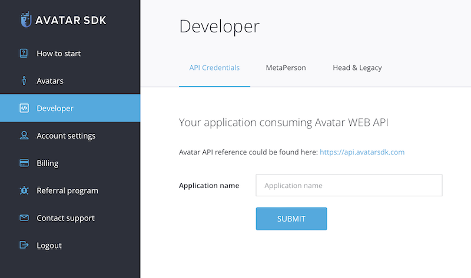
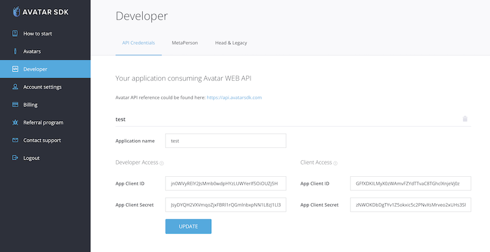

# Getting started

## Account

To start using MetaPerson Creator, simply create an account on [our website](https://accounts.avatarsdk.com) and take advantage of our [free trial](https://avatarsdk.com/pricing-cloud/) of the Pro plan. The trial gives you access to all of our advanced features and allows you to create and customize MetaPerson avatars. 

## Developer credentials

Before you can authorize MetaPerson Creator to integrate it into your website or application, you need to generate developer credentials in your profile. This is a simple process that can be done by visiting the developer credentials page on [our website](https://accounts.avatarsdk.com/developer/#web-api).

Once you're on the developer page, you'll need to create a new application to get your "App Client ID" and "App Client Secret" values. These values are required for integrating MetaPerson Creator into your website or application. For this purpose, you need to enter any name in the "Application name" field and press the "SUBMIT" button.

After the creation of the application, it will show your "App Client ID" and "App Client Secret" values.

With your developer credentials in hand, you can now integrate MetaPerson Creator into your website or application and start creating custom avatars for your users. If you need any help or have any questions along the way, our [support team](mailto:support@avatarsdk.com) is always available to assist you.
