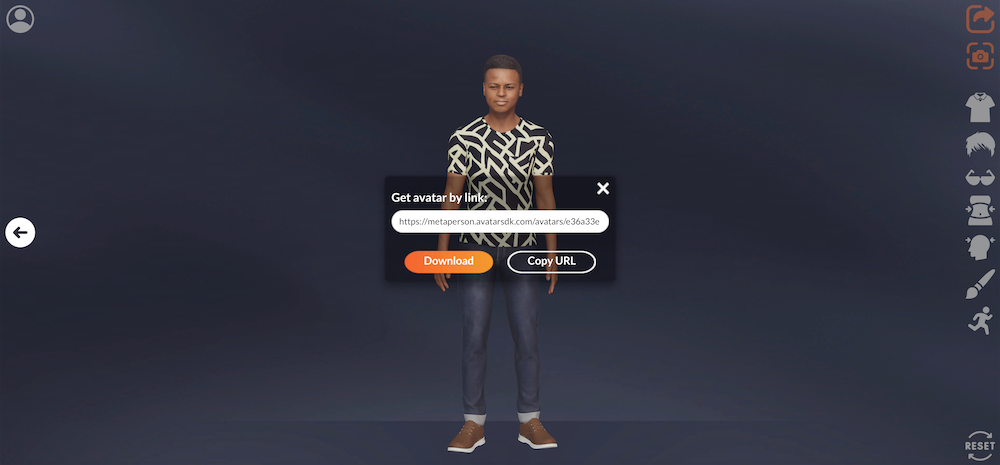

# JS API

Communication between an iframe with MetaPerson Creator and your page is performed via a messaging mechanism. Messages with special events are both posted to and received from the MetaPerson Creator.
The events should be sent after the load of the corresponding version of MetaPerson Creator. In the Desktop version, we use the "unity_loaded" event to signal about it, in the Mobile version the "mobile_loaded" is used. Please check the corresponding business.html sample described [here](web_integration).
Also you can check if the MetaPerson Creator is loaded via the `window.metaPersonCreator.isLoaded` parameter.

## Configuration events

Messages with these events can be sent only once right after the MetaPerson Creator was loaded.

* **Developer Credentials** - This is the call we discussed [earlier](web_integration) that allows you to add your developer credentials to the creator iframe. This ensures that your website or application is authorized to access the creator. If you type incorrect CLIENT_ID or CLIENT_ID export functionality will be unavailable, so please check these values. 

* **Export Parameters** - This event allows you to configure the export parameters for your avatar. You can specify the format of the exported file (such as GLB, GLTF, or FBX), the quality of the exported file, and other parameters.

* **UI Parameters** - This event allows you to configure some parts of the UI of MetaPerson Creator. E.g. hide some buttons or rename text for them etc. 

## Action events

These events tell the MetaPerson Creator to perform some specific actions.

* **Generate Avatar** - This event allows you to start avatar generation from API by passing an image encoded to base64 string.

* **Export Avatar** - This event allows you to export avatar from API. It can be required if you hide the button for export from the UI and want to control export functionality not from the iframe, but from an external website or application.

* **Show Avatar** - This event allows you to open an already-created avatar and customize it.

## Events from MetaPerson Creator

* **Model Exported** - The MetaPerson Creator sends this message when an avatar is exported. This event allows you to get the link to the resulting avatar. This link can then be used to download or integrate the avatar into your website or application.

* **Action Availability** - The MetaPerson Creator sends this message to tell whether the "Export Avatar" and the "Generate Avatar" actions are available at the current moment.


## Export Parameters

The call is for setting the export parameters. This allows you to customize the output of your avatar by specifying things like the file format, resolution, and other options. Here's an example of how you can use the export parameters request:

```
    let exportParametersMessage = {
        "eventName": "set_export_parameters",
        "format" : "gltf",
        "lod" : 1,
        "textureProfile" : "1K.jpg",
        "useZip" : true
    };
    evt.source.postMessage(exportParametersMessage, "*");
```

In this call, you can specify the format of the exported file, the level of detail (LOD), and the texture profile. This part is the same for Desktop and Mobile versions of MetaPerson Creator. 

Here's a breakdown of the parameters:

* **eventName** - This is the name of the event, which in this case is "set_export_parameters". This tells MetaPerson Creator which request you're making.
* **format** - This parameter specifies the format of the exported file. In this example, the format is set to "gltf". However, MetaPerson Creator also supports other formats such as "gltf", "glb", and "fbx".
* **lod** - This parameter specifies the level of detail (LOD) for the exported file. The higher the LOD, the more detailed the exported file will be. In this example, the LOD is set to 1. However, MetaPerson Creator also supports a LOD of 2.
* **textureProfile** - This parameter specifies the texture profile for the exported file. This determines the quality of the textures used in the exported file. In this example, the texture profile is set to "1K.jpg", which indicates that the textures will be 1K resolution and in the JPEG format. You can also use other texture profiles such as:
  * "4K.png", "2K.png", "1K.png"
  * "4K.jpg", "2K.jpg", "1K.jpg"
  * "4K.webp", "2K.webp", "1K.webp"
* **useZip** - By default after export Creator returns a public link to the Zip file with model and textures. In the case of formats supported by the embedded textures (glb and fbx), we can return a link only to the model file without using the archive, for this purpose this parameter should be set up to false. 

After setting these parameters, you can use the `postMessage()` method to send the Export Parameters call to MetaPerson Creator. This ensures that your exported avatar meets your specific needs and requirements.

## UI Parameters

This function allows customization of a bit of UI of MetaPerson Creator. This functionality differs between Mobile and Desktop versions, so we split this description correspondingly. 

## MetaPerson Creator Desktop

In the Desktop version, it allows to hide export button to use the **Export Avatar** function manually and control the modal window with an export link that shows after export.

```
let uiParametersMessage = {
    "eventName": "set_ui_parameters",
    "isExportButtonVisible" : true,
    "isLoginButtonVisible": true,
    "closeExportDialogWhenExportComlpeted" : false,
    "outfitsBlackList" : ["ARPI", "SEVAN"]
};
evt.source.postMessage(uiParametersMessage, "*");
```

Here's a breakdown of the parameters:

* **eventName** - This is the name of the event, which in this case is "set_ui_parameters". This tells MetaPerson Creator which request you're making.
* **isExportButtonVisible** - This parameter specifies should the UI includes the export button or not.
* **isLoginButtonVisible** - This parameter specifies should the UI includes the profile button or not. 
* **closeExportDialogWhenExportComlpeted** - This parameter specifies closing the modal window with the export link right after export completion. 
* **outfitsBlackList** - A list of outfits that are not available and not shown in the MetaPerson Creator. The complete list of outfits with their names can be found in [REST API documentation](https://api.avatarsdk.com/#id5). By default, all outfits are available. 

## MetaPerson Creator Mobile

In the Mobile version, this function includes a bit more options. 

```
let uiParametersMessage = {
    "eventName": "set_ui_parameters",
    "isExportButtonVisible": true,
    "isLoginButtonVisible": false,
    "exportButtonText": "Go",
    "theme": "light", 
    "gender": "female",
    "outfitsBlackList" : ["ARPI", "SEVAN"]
};
evt.source.postMessage(uiParametersMessage, "*");
```

The parameters of this code are:

* **eventName** - This is the name of the event, which in this case is "set_ui_parameters". This tells MetaPerson Creator which request you're making.
* **isExportButtonVisible** - This parameter specifies should the UI includes the export button or not.
* **isLoginButtonVisible** - This parameter specifies should the UI includes the profile button or not.
* **exportButtonText** - It allows to change the text of the export button. 
* **theme** - It allows to choose the visual theme for the UI (available options: "dark", "light").
* **gender** - If the application or website already has the information about the required gender, we can skip this question in the UI of the Mobile version. In this case, it shows the second screen with choosing input photo and you can't get back to the first screen with the home button. Available options are "male" and "female".
* **outfitsBlackList** - A list of outfits that are not available and not shown in the MetaPerson Creator. The complete list of outfits with their names can be found in [REST API documentation](https://api.avatarsdk.com/#id5). By default, all outfits are available. 

## Generate Avatar

The `generate_avatar` event initiates avatar generation.

```
    let generateAvatarMessage = {
        "eventName": "generate_avatar",
        "gender": "male",
        "age": "adult",
        "image": "image_encoded_to_base64_string"
    };
    evt.source.postMessage(generateAvatarMessage, "*"); 
```

Here's a breakdown of the parameters:

* **eventName** - This is the name of the event, which in this case is "generate_avatar". This tells MetaPerson Creator which request you're making.
* **gender** - This parameter specifies the gender of the computed avatar. Possible values are "male" and "female".
* **age** - This parameters specifies the age of the avatar. Possible values are "adult", "teen15" and "teen12". Default value is "adult". This parameter is available only for the Desktop version. 
* **image** - An image in JPEG or PNG format encoded into a base64 string. 

The "gender" parameter can be empty in the Desktop version. In this case, the MetaPerson Creator displays a dialog and prompts the user to manually select an avatar gender. 

## Export Avatar

The `export_avatar` event initiates an avatar export. Use this event when you need to implement your own "Export" button outside the iframe with MetaPerson Creator.
You need to find the iframe component with MetaPerson Creator on your page and post a message into it.

E.g. it can be done in the following way:

```
function onExportClicked() {
    let iframe = document.getElementById("editor_iframe");
    let exportAvatarMessage = {
        "eventName": "export_avatar"
    };
    iframe.contentWindow.postMessage(exportAvatarMessage, "*");
}
```

You need to be sure that the avatar is ready for export and displayed on the scene before calling this function.

## Show Avatar

It's possible to open a previously generated avatar for further customization. You'll need an "avatar code" to display it in the MetaPerson Creator.

```
let showAvatarMessage = {
    "eventName": "show_avatar",
    "avatarCode": AVATAR_CODE_TO_SHOW
};
evt.source.postMessage(showAvatarMessage, "*");
```

The parameters of this code are:

* **eventName** - This is the name of the event, which in this case is "show_avatar". This tells MetaPerson Creator which request you're making.
* **avatarCode** - A code of the avatar you need to open.

## Model Exported

You can use the `model_exported` event to receive the link to the exported avatar once the user has completed the export process. Also, this event returns the avatar's code and gender. The "avatar code" can be used to reopen the avatar for further modifications.



Here's an example code snippet that demonstrates how to do this:

```
function onWindowMessage(evt) {
    if (evt.type === "message") {
        if (evt.data?.source === "metaperson_creator"){
            let data = evt.data;
            let evtName = data?.eventName;
            if (evtName === "model_exported"){
                console.log("model url: " + data.url);
                console.log("gender: " + data.gender);
                console.log("avatar code: " + data.avatarCode);
            }
        }
    }
}
```

This code snippet sets up an event listener for the message event and checks if the eventName in the message data is `model_exported`. If it is, the code retrieves the avatar link from the message data and logs it to the console. You can modify this code to download the avatar or display it in your application as needed.

## Availability Of Avatar Generation And Export

The MetaPerson Creator sends this message outside the iframe to tell when it is possible to generate and export an avatar. If you design your own "Export" and "Generate Avatar" buttons, you can enable and disable them according to the parameters of the `action_availability_changed` event.

Here's an example code snippet that demonstrates how to receive this event:

```
function onWindowMessage(evt) {
    if (evt.type === "message") {
        if (evt.data?.source === "metaperson_creator"){
            let data = evt.data;
            let evtName = data?.eventName;
            if (evtName === "action_availability_changed"){
                if (data.actionName == "avatar_generation") {
                    let browseImageButton = document.getElementById("browse_image");
                    browseImageButton.disabled = !data.isAvailable;
                }
                else if (data.actionName == "avatar_export") {
                    let exportButton = document.getElementById("avatar_export");
                    exportButton.disabled = !data.isAvailable;
                }
            }
        }
    }
}
```

This code snippet sets up an event listener for the message event and checks if the eventName in the message data is `action_availability_changed`.

Here's a breakdown of the parameters:

* **eventName** - This is the name of the event the MetaPerson Creator sends. It is "action_availability_changed" in this case.
* **actionName** - The name of the actions whose availability has changed. Possible values are "avatar_generation" and "avatar_export".
* **isAvailable** - Indicates if this particular action is available. For example, whether you can generate or export an avatar at the current moment. 


If you need any help or guidance with our JS API or any other aspect of MetaPerson Creator, our [support team](mailto:support@avatarsdk.com) is always available to assist you.