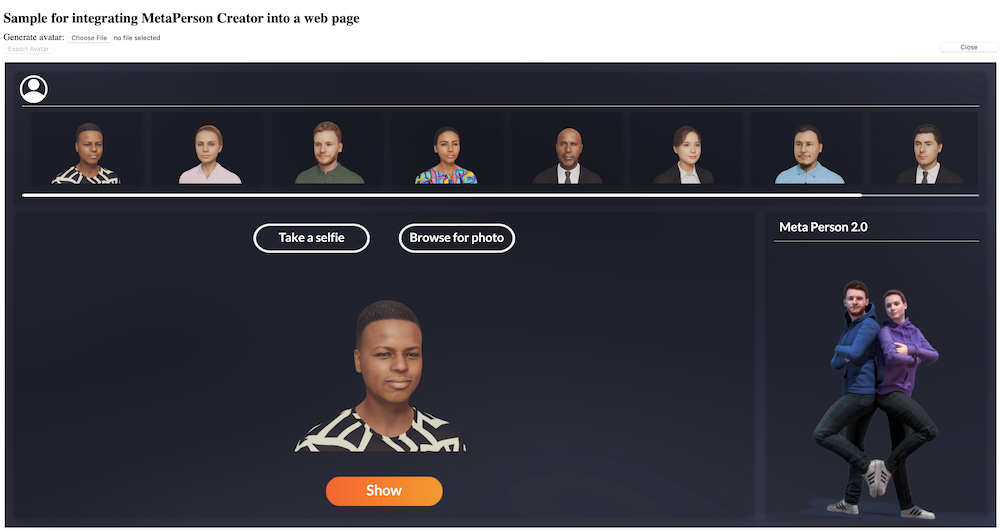
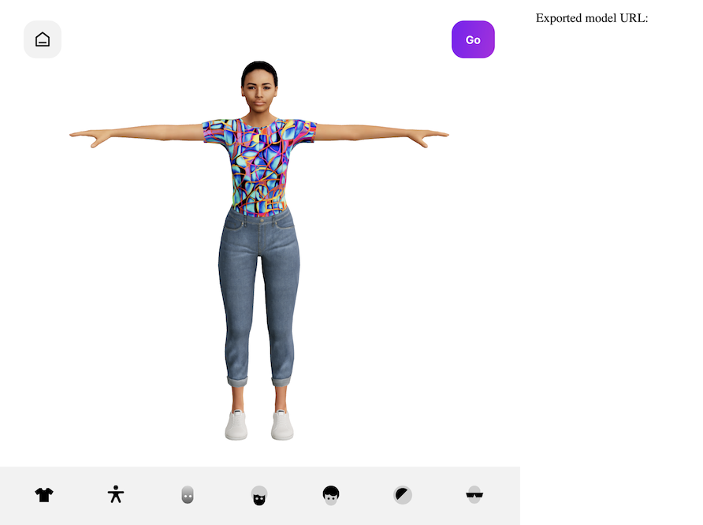

# Website integration

Integrating MetaPerson Creator into your website is easy and straightforward, thanks to our iframe mechanism and special JS API. This allows you to embed the creator directly into your website and set up, providing a seamless and intuitive experience for your users.

# MetaPerson Creator Desktop

To integrate MetaPerson Creator Desktop into your website, you'll need to first create an iframe element that references our creator URL. We recommend using the link [https://metaperson.avatarsdk.com/iframe.html](https://metaperson.avatarsdk.com/iframe.html) for MetaPerson Creator Desktop to use it in an iframe. It is the same version of MetaPerson Creator Desktop but without any additional controls, that allow easy resizing it to the size of the iframe element. 

`<iframe src="https://metaperson.avatarsdk.com/iframe.html" frameborder="0"></iframe>`

To connect MetaPerson Creator Desktop with your Avatar SDK account you need to use JS API to set your developer credentials to the iframe. 

```
function onUnityLoaded(evt, data) {
    let authenticationMessage = {
        "eventName": "authenticate",
        "clientId": CLIENT_ID,
        "clientSecret": CLIENT_SECRET,
    };
    evt.source.postMessage(authenticationMessage, "*");
}
```

Replace "CLIENT_ID" and "CLIENT_SECRET" with the values you received when you [created your application](getting_started). This will ensure that your website is authorized to access the creator and your avatar data.

It's important to ensure that you've correctly added your developer credentials to MetaPerson Creator to ensure that you have access to all of the creator's features, including the Export button. If you've incorrectly added your credentials, or if your account doesn't have a Pro plan or higher, the Export button may be inactive.

To avoid this issue, double-check that you've entered your c "CLIENT_ID" and "CLIENT_SECRET" values correctly and that your account is on the Pro plan or higher. If you're still experiencing issues, please don't hesitate to contact our [support team](mailto:support@avatarsdk.com) for assistance.

You can find the whole sample page with the integration at this link [https://metaperson.avatarsdk.com/business.html](https://metaperson.avatarsdk.com/business.html). Use the "Open MetaPerson Creator" button to open an iframe with MetaPerson Creator. Also, here you can specify your developer credentials with the UI controls. Please investigate the page source to look at the integration sample. Please pay attention to JS API calls on this sample page. 



Once you've added the iframe to your website, your users can start creating their own avatars directly from your website. They can upload a selfie, customize their avatar's features, hairstyles, outfits, and body settings, and then download or integrate their avatar into your product.
	
# MetaPerson Creator Mobile

Integration of MetaPerson Creator Mobile is almost the same but you need to use another link to make it. We recommend using the link [https://mobile.metaperson.avatarsdk.com/generator](https://mobile.metaperson.avatarsdk.com/generator) for MetaPerson Creator Mobile to use it in an iframe. 

To connect MetaPerson Creator Mobile with your Avatar SDK account you need to use almost the same JS API to set your developer credentials to the iframe. 

```
function onMobileLoaded(evt, data) {
    let authenticationMessage = {
        "eventName": "authenticate",
        "clientId": CLIENT_ID,
        "clientSecret": CLIENT_SECRET,
    };
    evt.source.postMessage(authenticationMessage, "*");
}
```

You also can find the whole sample page with the integration at this link [https://mobile.metaperson.avatarsdk.com/business.html](https://mobile.metaperson.avatarsdk.com/business.html). Please investigate the page source to look at the integration sample. Please pay attention to JS API calls on this sample page. 

