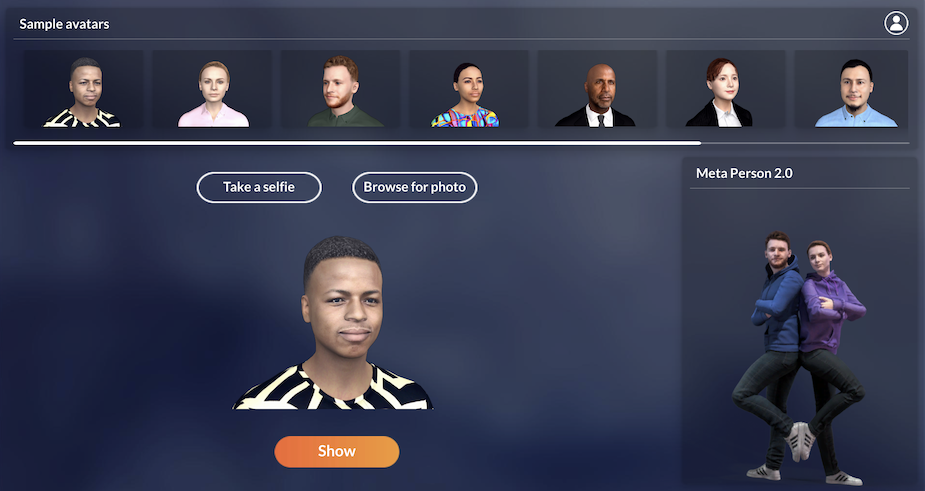
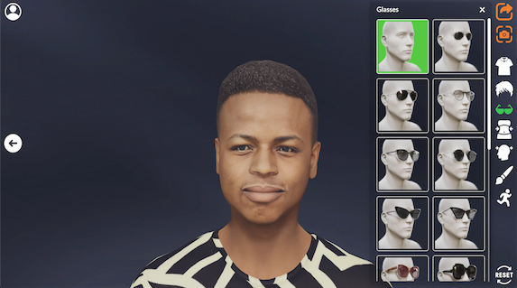
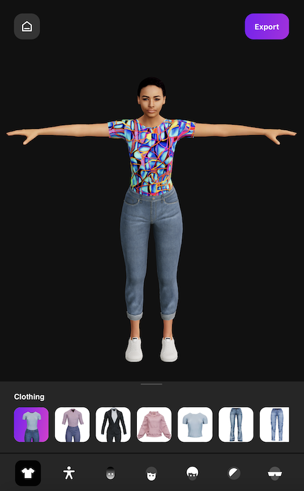

# What is MetaPerson Creator

Introducing [MetaPerson Creator](https://metaperson.avatarsdk.com) – the revolutionary 3D avatar builder that allows you to create your own lifelike avatar using just a selfie! 

With MetaPerson Creator, you have complete control over every aspect of your avatar, from its facial features to its body type, outfits, and hairstyles.
Our advanced technology uses the latest in facial recognition and 3D modeling to create an avatar that closely resembles you. You can customize your avatar by adjusting its facial features like the shape of your nose, eyes, and mouth. Plus, you can experiment with different hairstyles and colors until you find the perfect look.

The body settings feature allows you to adjust your avatar's body shape to make it even more personalized. Whether you want a more muscular build or a curvier figure, you can create an avatar that looks just like you or the way you envision yourself.

MetaPerson Creator is perfect for anyone who wants to create a unique 3D avatar for gaming, social media, or just for fun. It's easy to use and doesn't require any special skills or knowledge. So what are you waiting for? Try [MetaPerson Creator](https://metaperson.avatarsdk.com) today and bring your avatar to life!

Currently, MetaPerson Creator includes two independent implementations. The first one *MetaPerson Creator Desktop* is based on Unity WebGL, and the second one *MetaPerson Creator Mobile* uses React.js and three.js for better support for mobile devices. If you open the MetaPerson Creator link [MetaPerson Creator](https://metaperson.avatarsdk.com) from your mobile device it will redirect you to [https://mobile.metaperson.avatarsdk.com](https://mobile.metaperson.avatarsdk.com). You can use the latest link independently for your projects. The UI here is better suited for different scales, but the features set can be different between these versions. 

